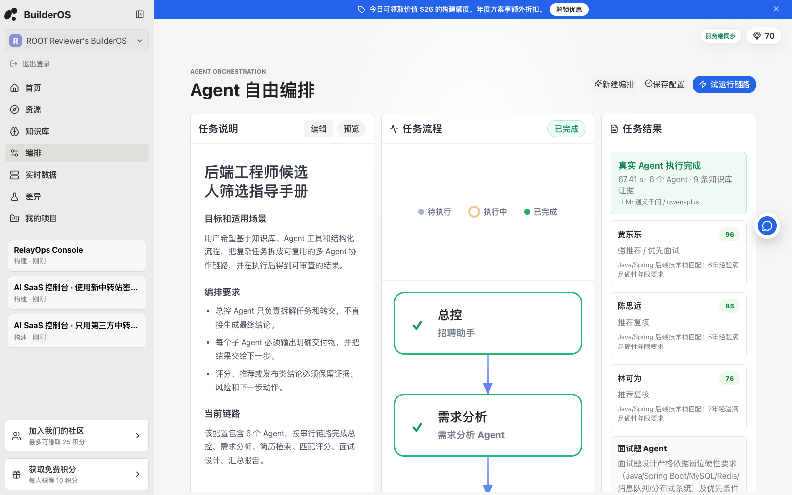

# Atoms Demo - he0yan

## 1. 笔试文档

本项目实现了一个可运行的 Atoms-like Demo，并命名为 BuilderOS：用户通过自然语言描述需求，平台使用 LLM 网关和多智能体流程生成一个可交互网页应用，同时产出项目文件夹、源码包、版本记录和发布预览。作品目标不是做一个静态仿站，而是交付一个评委可以真实注册、登录、构建、查看源码、下载产物和验证服务端数据的 AI Native 应用生成平台原型。

产品定位：Atoms 偏“输入想法后自动生成产品”，BuilderOS 在这个基础上额外强调“过程可见、Agent 可配置、执行可审查”。因此本次 Demo 除了实现 Atoms-like 的首页生成体验，还吸收了我另一套 OmniAgent 平台中的 Agent 编排思路，把隐式多智能体工作流做成显式自由编排能力：评委可以看到每个 Agent 的角色、系统提示词、模型路由、工具、输入输出、Guardrail 和执行 Trace。

相对 Atoms，BuilderOS 重点扩展了三类能力：第一是显式 Agent 编排，把自动化 Agent 链路变成可配置、可审查的工作流；第二是知识 grounding，把知识库、文件解析和 RAG 证据作为生成结果的依据；第三是运行审计与可观测性，把 API 健康、服务状态、持久化路径、运行记录和 Agent Orchestrator 状态通过实时数据页暴露出来。换句话说，Atoms 强在自动生成和自动配置，BuilderOS 希望把生成过程、知识依据、Agent 调度和运行状态做成可复盘的 Builder 控制台。

标题：Atoms Demo - he0yan

## 2. 已部署的可测试链接

- Demo: https://builder.poppcic.cn/
- 评审演示账号：`reviewer@builderos.demo`
- 评审演示密码：`BuilderOS2026`
- 说明：演示账号为生产 MySQL 中的真实测试用户，已预置多条 Demo 构建记录，便于快速评审；也可以自行创建新工作区完成注册和构建流程。

## 3. 代码链接

- GitHub: https://github.com/heyrry/builderos-atoms-demo

## 4. 建议评审路径

1. 打开 `https://builder.poppcic.cn/`，使用演示账号或自行注册工作区。
2. 在首页输入需求，例如“生成一个带登录、订阅和仪表盘的 AI 客服 SaaS”；顶部模型路由可切换 `Auto / qwen-plus / gpt-5.5`，其中 `gpt-5.5` 走 `https://token-qiv.cn/` 第三方 OpenAI 兼容中转站。
3. 等待 Agent Run 完成，查看生成应用预览、Agent 决策、RAG 证据和模型来源。
4. 打开文件视图，查看 `app/frontend/src/App.tsx`、`src/styles.css`、`src/data/generated.ts` 等生成文件。
5. 点击源码包下载，验证平台会生成完整项目文件夹和 manifest。
6. 点击发布，打开 `/api/preview/:id` 的公开预览链接。
7. 进入资源、知识库、实时数据、差异页面，查看 BuilderOS 相对 Atoms 的扩展能力：知识库负责 grounding 和文件解析，实时数据负责运行审计、服务健康和持久化状态；知识库页面支持上传 `.txt / .md / .csv / .json`，服务端会解析文本并生成可召回知识条目。
8. 进入“编排”页面，体验 OmniAgent 风格的 Agent 链路：查看任务说明、垂直任务流程、任务结果三栏工作台；点击“试运行链路”会由后端按预定义 Agent 链真实调用 LLM，并基于服务端知识库中的简历数据生成候选人推荐结果。

## 5. 重点亮点：流程编排与 Agent 调度

在线演示路径：

- 入口：`https://builder.poppcic.cn/?section=orchestration`
- 操作：登录演示账号后进入“编排”页，先查看下方 Agent 配置卡片，再点击右上角“试运行链路”或左下角“开始执行”。该动作会请求后端 `/api/orchestrations/:id/run`，由服务端串行调度 Agent、读取知识库并调用真实 LLM。

效果图：

### 5.1 流程编排

BuilderOS 在 Atoms-like 应用生成主流程之外，增加了一个 OmniAgent 风格的显式 Agent 编排能力。Atoms 的多 Agent 协作更多是平台内部自动化，BuilderOS 选择把这条链路展开给评委看：当前版本先实现“预定义 Agent 链 + 可编辑 Agent 配置 + 真实后端执行”，不把时间投入到拖拽式 DAG 画布。用户可以从“招聘多 Agent 编排模板”开始，也可以复制为自己的配置后继续编辑。一个编排配置由多个步骤组成，每个步骤都包含：

- Agent 名称：例如招聘助手、需求分析 Agent、简历检索 Agent、匹配评分 Agent、面试题 Agent、报告汇总 Agent。
- 角色职责：定义该 Agent 在链路中的职责边界。
- 系统提示词：定义该 Agent 的行为、输出边界和证据约束。
- 模型路由：每个 Agent 可选择继承顶部路由，也可单独绑定 `Auto`、`qwen-plus` 或 `gpt-5.5`。
- 执行动作：定义当前步骤要做什么。
- 输出产物：定义要交给下一步的结构化结果。
- 工具绑定：例如 Planner、RAG、Search、Ranker、Generator、Reporter。
- 守护规则：用于约束该步骤的输出质量和可审查性。

### 5.2 Agent 调度

当前 Demo 采用串行调度模型，核心思路是让总控 Agent 负责拆解任务和分发，子 Agent 只处理自己的职责范围。执行时不是前端 mock：服务端会读取已保存的编排配置、检索知识库中的岗位需求和候选人简历，然后每个 Agent 节点按“节点模型配置优先，其次继承顶部路由”的规则，通过 OpenAI 兼容接口调用对应 LLM provider：

1. 总控 Agent 接收用户目标，拆解执行计划。
2. 需求分析 Agent 抽取岗位画像、硬性条件和优先级。
3. 简历检索 Agent 基于知识库或资料来源召回候选人。
4. 匹配评分 Agent 对候选人进行排序和解释。
5. 面试题 Agent 根据候选人特征生成追问方向。
6. 报告汇总 Agent 输出最终推荐、风险和下一步动作。

这种设计避免一个大 Agent 一次性完成所有事情，而是把复杂任务拆成可复用、可替换、可审查的工作流节点。本轮线上验证中，链路使用通义千问 `qwen-plus` 完成 6 个 Agent 节点调用，命中 9 条知识库证据，并输出来自服务端知识库的候选人排序。

### 5.3 流程可视化

编排页使用三栏执行工作台展示整个过程：

- 左侧“任务说明”：展示任务背景、适用场景、编排要求和当前链路。
- 中间“任务流程”：用垂直节点展示 Agent 执行链路，并区分待执行、执行中、已完成状态。
- 右侧“任务结果”：执行后展示真实 Agent 输出摘要、LLM provider、知识库证据数量、候选人排序、评分和最终交付。

相比单纯列表，这种三栏结构可以让评委直观看到“输入任务 -> Agent 调度 -> 结果输出”的闭环。

### 5.4 校验与可审查性

编排能力不仅是 UI 展示，也接入了服务端状态、真实 LLM 调用和运行校验：

- 配置持久化：编排配置写入服务端 `state.json`，刷新页面后仍可恢复。
- 健康状态：`/api/status` 中新增 `Agent Orchestrator` 服务项，实时数据页可看到健康状态。
- 资源台证明：`/api/cloud-resources` 中新增 `Agent 自由编排` 资源卡，展示当前 flows / steps 数量。
- 真实 Agent Runtime：`/api/orchestrations/:id/run` 按步骤串行执行招聘助手、需求分析、简历检索、匹配评分、面试题、报告汇总等 Agent。
- 知识库 grounding：演示环境的服务端知识库已预置岗位需求和 4 份匿名候选人简历，也支持上传文件继续扩展；结果必须从知识库证据中产生，而不是静态 mock。
- 文件解析 RAG：知识库页面可上传 `.txt / .md / .csv / .json`，服务端解析内容、切块并写入知识条目；简历类文件会自动打上 `简历 / 候选人 / Java / 后端` 标签，随后参与 Agent 编排召回。
- 试运行追踪：点击“试运行链路”会生成 Execution Trace，记录每个 Agent 的动作、耗时、LLM provider、证据标题和输出。
- 输出校验：每个步骤都有 guardrail，例如“输出必须附带依据”“分数必须可解释”“结论和证据一一对应”。
- 当前边界：拖拽式自由编排、DAG 分支、失败重试和人工确认节点已作为后续迭代，不在本轮 6-8 小时 Demo 中展开；第三方中转站 `gpt-5.5` 已配置为可切换 provider，用于展示第三方模型接入和 token 记录，复杂长链路演示默认建议使用 `qwen-plus` 保证稳定性。

## 6. 实现思路与关键取舍

- 使用 React + TypeScript + Vite 快速构建可体验产品原型。
- 首次进入提供工作区初始化和注册，用户信息、密码哈希和会话写入 MySQL。
- 登录不会自动创建用户；未注册邮箱会返回错误，已注册用户可通过邮箱和密码恢复工作区。
- 侧边栏提供退出登录入口，退出时清除本地 token，并调用服务端 logout 接口让 session 失效。
- 登录页提供评审演示账号快捷填充，账号本身真实存在于生产 MySQL，便于评委直接进入预置 Demo 工作区。
- 使用多 Agent 时间线模拟 Team Mode 的协作过程。
- 参考 OmniAgent 当前“通义千问 + 第三方中转站”的模型接入方式，服务端支持 OpenAI 兼容 `/chat/completions`，密钥通过环境变量配置并在状态接口中脱敏展示。
- 登录后顶部提供模型路由选择器，评委可在 `Auto`、`qwen-plus` 和 `gpt-5.5` 间切换；编排页的 Agent 配置卡片也可为单个 Agent 独立选择模型。选择 `gpt-5.5` 时构建和 Agent 编排会直接走 `token-qiv.cn` 第三方中转站。
- 积分当前只作为额度展示，不限制构建次数，也不在 Demo 中扣减；这是为了让评委评审时不被 quota 阻断。
- 当前线上已验证通义千问 `qwen-plus` 与第三方中转站 `gpt-5.5` 均可成功生成项目规格；当模型不可用时，系统会自动降级到本地模板生成器，保证 Demo 稳定可用。
- 根据 prompt 识别 SaaS、电商、招聘、研究、视频等类型，生成不同页面结构、功能列表、指标和 React/Vite 项目文件。
- 使用 iframe `srcDoc` 渲染生成结果，让评审可以直接操作生成出的应用。
- 生成项目文件树，展示 `app/frontend/src/App.tsx`、`src/data/generated.ts`、`src/styles.css`、`app/generated/preview.html` 等路径，并支持点击查看/复制文件。
- 服务端提供 zip 源码包下载接口，评审可直接下载完整生成项目和 manifest。
- 新增版本管理：构建后默认生成版本快照，支持手动保存新版本。
- 新增真实发布预览：发布后写入发布状态、发布检查和可访问 URL，`/api/preview/:id` 可直接打开生成应用。
- 新增 BuilderOS Cloud 资源台：对标 Atoms Cloud 的 AI、Database、Users、Secrets、App Storage、GitHub、Stripe、Growth 能力，支持连接状态持久化。
- 新增 Agent 编排运行时：参考 OmniAgent 的 Agent 编排能力，提供招聘多 Agent 模板，支持三栏执行工作台、编辑执行链、保存配置、后端真实 LLM 调度和知识库 grounding。
- 新增 BuilderOS 增强型 RAG 知识库页面：这是相对 Atoms 的知识 grounding 扩展，支持手动写入和 `.txt / .md / .csv / .json` 文件解析，生成和编排时召回资料并展示证据，避免结果变成无来源的静态 mock。
- 生产环境使用 MySQL 保存用户和 session，使用 Node API 保存项目、知识库、构建运行记录和项目文件 manifest，浏览器离线或 API 不可用时降级到 `localStorage`。
- 生产环境将生成文件落盘到 `/opt/builderos/data/generated-projects/project-<id>/`，并提供 `/api/projects/:id/files` 查询。
- 新增实时数据页：这是相对 Atoms 的运行审计与可观测性扩展，展示 BuilderOS API、Auth Store、Build Engine、RAG Engine、Agent Orchestrator、服务端进程、持久化文件和最近构建记录，证明平台有真实后端和可追踪状态。
- 新增 `/api/llm/status` 和构建记录中的模型元数据，评审可看到本次构建使用真实 LLM 还是模板降级。
- Race Mode 作为延展能力：开启后生成多个方案方向和评分，体现多模型/多方案竞争的产品思路。
- 新增“平台差异与扩展”页面，说明相对 Atoms 增加的 grounding、源码交付、执行轨迹和部署检查能力。

## 7. 当前完成程度

已完成：

- 首页工作台
- 初始化/注册工作区
- MySQL 用户注册、登录和 session 恢复
- 退出登录和服务端 session 失效
- 通义千问 / 第三方中转站 OpenAI 兼容模型网关
- 第三方平台 LLM：`https://token-qiv.cn/`，模型路由为 `gpt-5.5`
- 模型状态接口和模板降级策略
- 项目创建流程
- Agent 构建进度
- 生成应用预览
- 生成源码展示
- 生成 React/Vite 项目文件夹
- 文件树浏览和文件级源码复制
- 源码复制、HTML 导出与 zip 源码包下载
- 版本快照
- 真实发布预览链接
- 发布检查
- BuilderOS Cloud 资源台
- OmniAgent 风格 Agent 链路编排
- 任务说明 / 任务流程 / 任务结果三栏执行态
- 编排模板复制、步骤编辑、Agent 添加/删除
- 编排配置服务端持久化
- 编排后端真实执行、LLM 调用和 Execution Trace
- 服务端知识库预置岗位需求和匿名候选人简历
- 知识库文件上传解析：`.txt / .md / .csv / .json`
- 简历文件自动标签：`简历 / 候选人 / Java / 后端`
- 项目列表
- 发布状态
- 服务端持久化
- 知识库写入和召回
- 服务端构建 API
- 实时数据和运行日志
- Atoms 差异说明
- 响应式布局
- 积分展示但暂不限制使用

时间限制下明确未完成，但已设计后续路径：

- 真实代码沙箱执行和依赖安装日志
- 真实 GitHub 同步
- 真实云发布
- 第三方 OAuth 和团队权限
- 向量数据库级 RAG、embedding、rerank
- PDF/DOCX 文件解析、页码引用和段落级来源追踪
- 拖拽式自由编排、DAG 分支、节点重试和人工确认

## 8. 线上验证状态

- 公网入口：`https://builder.poppcic.cn/`
- API 状态：`/api/status` 当前返回 healthy，存储目录为 `/opt/builderos/data`。
- LLM 状态：`/api/llm/status` 当前为 real mode，主路由为通义千问 `qwen-plus`，第三方平台 provider 为 `token-qiv.cn / gpt-5.5`；顶部模型路由选择器可手动切到 `gpt-5.5` 并在 `token-qiv.cn` 看到请求记录。
- 持久化：用户和 session 走 MySQL；项目、知识库、文件解析结果、运行记录和生成文件 manifest 走服务端数据目录。
- 知识 grounding：知识库不是静态展示页，而是构建和 Agent 编排的召回来源；上传文件会解析为知识条目，简历类资料会自动打标签并参与候选人筛选。
- 运行审计：实时数据页不是装饰性 dashboard，而是把服务健康、运行记录、RAG/Build/Agent Orchestrator 状态和持久化路径显式暴露给评委。
- 延展能力：`编排` 页面提供预定义 Agent 链真实执行，配置写入服务端 state，运行结果来自 LLM 调用和知识库简历，实时数据页显示 Agent Orchestrator 健康状态。
- 生成文件：生产环境落盘到 `/opt/builderos/data/generated-projects/project-<id>/`，并可通过 zip 下载。

## 9. 后续扩展优先级

1. 沙箱执行优先：接入隔离容器，真实运行 `npm install`、`npm run build` 和自动修错循环，让平台从“生成代码”升级为“生成并验证代码”。
2. 显式自由编排增强：把当前串行 Agent 链升级为可拖拽 DAG，补充分支条件、失败重试、人工确认、节点级超时、节点级模型成本和审计日志。这是 BuilderOS 区别于 Atoms 的重点方向，也承接 OmniAgent 的自由编排优势。
3. GitHub 与发布流水线：接入 GitHub OAuth，支持一键创建仓库、提交生成文件、打开 PR；再接入 Vercel 或 Cloudflare Pages API，把当前 `/api/preview/:id` 升级为真实部署。
4. RAG 增强：当前版本是 keyword RAG + 文件解析；下一步升级 embeddings + 向量数据库 + rerank，并补充 PDF/DOCX 解析、页码引用和段落级来源追踪。
5. 计费与积分系统：当前 Demo 积分不做限制，只用于展示。后续会设计完整账务闭环：模型调用按 provider/model 记录 token、延迟和成本；构建、Agent 编排、文件解析、发布等动作生成 usage ledger；用户可通过 Stripe/支付宝/微信或企业转账充值；充值写入 balance ledger，消费按额度扣减；订阅套餐提供每月额度、团队席位、私有项目、并发构建和高级模型权限；异常退款和人工加款保留审计记录。
6. 多模型调度：按任务类型选择 Qwen、第三方中转站或其他模型，增加成本、延迟、成功率和质量评分；长期目标是让 Agent 编排可以按节点选择“便宜模型 / 强模型 / 快模型”。
7. 团队协作与真实连接器：增加 workspace 成员、角色权限、项目评论、版本 diff 和审查记录；把 GitHub、Stripe、Growth、Storage 等资源台从 Demo 状态机升级为 OAuth/Token 驱动的真实连接器。

## 10. AI 工具使用情况

| 工具 | 用途 | 套餐 / 投入 |
|------|------|------------|
| **Claude Code** | 本项目主力工具，代码生成、架构设计、调试迭代 | PRO 5X × 1 + TEAM × 2，当前 3 账号周用量均达 97–100% |
| **Codex** | 本项目主力工具，代码生成、逻辑实现、功能迭代、部署验证 | 高频使用，账单截图可按需补充 |
| **Qoder**（阿里巴巴 AI IDE） | AI 编码环境，深度参与日常工作流 | 高频使用 |
| **token-qiv.cn** | 本人运营的 OpenAI 兼容中转服务，BuilderOS Demo 的 `gpt-5.5` 路由即通过此服务接入；切换模型路由后可在后台验证真实请求记录 | 自建运营 |
